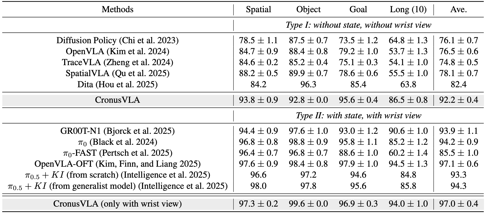

<br>
<p align="center">
  <h1 align="center"><strong>CronusVLA:<br>Towards Efficient and Robust Manipulation
<br>via Multi-Frame Vision-Language-Action Modeling</strong></h1>
  <p align="center">
    <a href='' target='_blank'>Hao Li*</a>, <a href='' target='_blank'>Shuai Yang*</a>, <a href='https://yilunchen.com/about/' target='_blank'>Yilun Chen</a>, <a href='' target='_blank'>Xinyi Chen</a>, <a href='' target='_blank'>Xiaoda Yang</a>, <a href='' target='_blank'>Yang Tian</a>, <br><a href='https://hanqingwangai.github.io/' target='_blank'>Hanqing Wang</a>, <a href='https://tai-wang.github.io/' target='_blank'>Tai Wang</a>, <a href='http://dahua.site/' target='_blank'>Dahua Lin</a>, <a href='https://scholar.google.co.uk/citations?user=r6CvuOUAAAAJ&hl=en' target='_blank'>Feng Zhao</a>, <a href='https://oceanpang.github.io/' target='_blank'>Jiangmiao Pang</a>
    <br>
    * Equal Contributions
    <br>
    University of Science and Technology of China, Shanghai Artificial Intelligence Laboratory, <br> Zhejiang University, The Chinese University of Hong Kong
    <br>
  </p>


<p align="center">
<a href="https://github.com/InternRobotics/CronusVLA/">
  
</a>
<a href="https://github.com/LiHaoHN/SimX-OR">
  
</a>
</p>

<p align="center">
  <a href="https://arxiv.org/abs/2506.19816/">
    
  </a>
  <a href="https://LiHaoHN.github.io/CronusVLA.github/">
    
  </a>
  <a href="https://huggingface.co/JeasLee/models">
    
  </a>
  <a href="https://github.com/LiHaoHN/SimX-OR">
    
  </a>
  <a href="https://github.com/user-attachments/assets/230481e1-7105-4ed7-9a58-d7af4713e044">
    
  </a>
</p>

## 📋 Contents

- [🔥 Overview](#overview)
- [⚙️ Installation](#getting_started)
- [📥 Downloading](#Downloading)
- [📊 Evaluating CronusVLA](#Evaluating)
- [💪 Training CronusVLA](#Training)
- [📌 TODO](#todo)
- [🔗 Citation](#citation)
- [👏 Acknowledgements](#acknowledgements)


## 🔥 Overview <a id="overview"></a>

**CronusVLA** is a general framework that extends **single-frame VLA models** to the **multi-frame paradigm** through a two-stage design. It achieves:
- Efficient temporal modeling and inference, available in both **7B** and **0.5B** versions.
- Leading performance on **SimplerEnv**, **LIBERO**, and **real-world Franka** experiments.
- High robustness on the **SimplerEnv-OR** benchmark and real-world robustness tests.  
- Introduction of **SimplerEnv-OR**, a novel benchmark for quantitative evaluation of model robustness under observational disturbances.


<div align="center">
  
</div>

---

## ⚙️ Installation <a id="getting_started"></a>

### CronusVLA Environment
The codebase is built with **Python 3.10** and supports **Python ≥ 3.8**. We require **PyTorch ≥ 2.2.0** and **CUDA ≥ 12.0**. We recommend setting up the environment via [Conda](https://www.anaconda.com/docs/getting-started/working-with-conda/packages/install-packages#installing-conda-packages) or [Miniconda](https://docs.conda.io/en/latest/miniconda.html):
```bash
# Create and activate a virtual environment
conda create --name cronusvla python=3.10
conda activate cronusvla
```
Next, clone our repo and install the required packages:
```bash
# Clone the repo (with the newest version)
git clone https://github.com/InternRobotics/CronusVLA
cd CronusVLA

# Install PyTorch (with CUDA 12.1 support)
pip install torch==2.2.0 torchvision==0.17.0 torchaudio==2.2.0 --index-url https://download.pytorch.org/whl/cu121

# Install additional dependencies
pip install transformers==4.40.1 accelerate==1.2.1 peft==0.11.1
pip install numpy==1.26.4

## Training setup
# Install Flash Attention 2 for training (https://github.com/Dao-AILab/flash-attention) acceleration
# =>> If you run into difficulty, try `pip cache remove flash_attn` first
pip install packaging ninja
ninja --version; echo $?  # Verify Ninja --> should return exit code "0"

pip install flash-attn==2.5.5 --no-build-isolation
# or pip install https://github.com/Dao-AILab/flash-attention/releases/download/v2.5.5/flash_attn-2.5.5+cu122torch2.2cxx11abiFALSE-cp310-cp310-linux_x86_64.whl

# Install project dependencies
pip install -r requirements.txt
```

### BridgeData V2 WidowX (Evaluation) <a id="real_WidowX"></a>
The related experiments are in `./experiments/real_widowx`. Our repo support both [CronusVLA-7B](https://huggingface.co/JeasLee/cronusvla_7B_bridge_rt_1) & [-0.5B](https://huggingface.co/JeasLee/cronusvla_0.5B_bridge_rt_1) on real-world WidowX robot. Please follow [OpenVLA](https://github.com/openvla/openvla#setup) setup guide to install `widowx_envs` environments.

### SimplerEnv (Evaluation)
The SimplerEnv experiments are located in `./experiments/SimplerEnv`.

1. Clone the [ManiSkill2\_real2sim](https://github.com/simpler-env/ManiSkill2_real2sim) repository under `./experiments/SimplerEnv`.

2. Follow the respective `README.md` files to install both **SimplerEnv** and **ManiSkill2**.
```bash
conda activate cronusvla
cd ./experiments/SimplerEnv
# install Maniskill2
git clone https://github.com/simpler-env/ManiSkill2_real2sim
cd ManiSkill2_real2sim
pip install -e .
# install SimplerEnv
cd ..
pip install -e .
```
3. SimplerEnv also requires Vulkan runtime libraries:

```bash
# Install Vulkan runtime libraries and tools
conda install conda-forge::libvulkan-loader
```

### LIBERO Environment (Evaluation)
The LIBERO experiments are located in `./experiments/Libero`.

>***⚠️ Note***: LIBERO dependencies differ from the training environment. We recommend creating a separate environment for LIBERO evaluation.
```bash
conda create --name cronusvla_libero --clone cronusvla
conda activate cronusvla_libero
```
Then, clone and install the LIBERO repo:

```bash
git clone https://github.com/Lifelong-Robot-Learning/LIBERO.git libero
cd libero
pip install -e .
```
Install additional requirements:

```bash
cd deploy/libero
pip install -r libero_requirements.txt
```

### Real-world Franka (Evaluation)
The Franka evaluation setup is in `./experiments/real_franka`.
- Client side: only requires a Python environment and the ``requests`` library, 
```bash
pip install requests
```
- Serve side: activate the environment and install flask:
```bash
conda activate cronusvla
pip install flask
```

Dependencies for the Franka robot can follow this [repo](https://github.com/iamlab-cmu/frankapy). 

---

## 📥 Downloading <a id="Downloading"></a>
### Pretraining & Post-training Date
We follow [OpenVLA](https://github.com/openvla/openvla) to pretrain the 7B single-frame VLA model, and [MiniVLA](https://github.com/Stanford-ILIAD/openvla-mini) to pretrain the 0.5B  model. Based on these pretrained models, we conduct multi-frame post-training as follows:

- **Pretraining:** We primarily use the `oxe_magic_soup_plus_minus` suite as defined in [mixtures.py](./prismatic/vla/datasets/rlds/oxe/mixtures.py).  
- **Post-training:** We mainly use the `bridge_dataset` ([BridgeData V2](https://rail.eecs.berkeley.edu/datasets/bridge_release/data/tfds/bridge_dataset/)) and `fractal20220817_data` ([RT-1](https://github.com/google-research/robotics_transformer)) datasets within the `bridge_rt_1` suite (see [mixtures.py](./prismatic/vla/datasets/rlds/oxe/mixtures.py)).  
- Each dataset can be downloaded from [Open X-Embodiment (OXE)](https://robotics-transformer-x.github.io/) in [RLDS format](https://github.com/google-research/rlds) (see this [example script](https://github.com/moojink/rlds_dataset_mod/blob/main/prepare_open_x.sh) for how to download datasets from OXE).  
- For the BridgeData V2 component, note that the OXE version is outdated (as of 12/20/2023). Instead, download the dataset directly from the [official source](https://rail.eecs.berkeley.edu/datasets/bridge_release/data/tfds/bridge_dataset/) and place it in the `bridge_dataset/` subdirectory. Replace any reference to `bridge` in the OXE code with `bridge_dataset`.  
- Ensure that `--run_root_dir` points to the directory containing your OXE datasets.
```bash
# Change directory to your base datasets folder
cd <PATH TO BASE DATASETS DIR>

# Download the full dataset (124 GB)
wget -r -nH --cut-dirs=4 --reject="index.html*" https://rail.eecs.berkeley.edu/datasets/bridge_release/data/tfds/bridge_dataset/
```


### Finetuning Data
We mainly finetune CronusVLA on [LIBERO](https://github.com/Lifelong-Robot-Learning/LIBERO) and our customed data ([script example](https://github.com/InternRobotics/InstructVLA/tree/main/data_pipeline/real_data_script)):

- LIBERO datasets, including LIBERO-Spatial, -Object, -Goal, and -10 (-Long), can be downloaded in RLDS format (~10 GB total) from this [link](https://huggingface.co/datasets/openvla/modified_libero_rlds). The corresponding suit names of [mixtures.py](./prismatic/vla/datasets/rlds/oxe/mixtures.py) is `libero_spatial_no_noops`, `libero_object_no_noops`, `libero_goal_no_noops`, `libero_10_no_noops`.

- If you have a custom dataset that is not part of OXE, you can convert the dataset to the RLDS format (see [this repo](https://github.com/kpertsch/rlds_dataset_builder)). The corresponding suit of [mixtures.py](./prismatic/vla/datasets/rlds/oxe/mixtures.py) is `custom`.

- Ensure that `--run_root_dir` points to the directory containing your LIBERO/Custom datasets.

### Pretrained Weights <a id="Pretrained_Weights"></a>
1. Create an empty folder named `./outputs`, we mainly provide post-trained and finetuned checkpoints. The pretrained 7B checkpoints can be downloaded [here](https://huggingface.co/openvla/openvla-7b-prismatic), and more checkpoints will be released soon at this [page](https://huggingface.co/JeasLee/models).
```bash
mkdir -p outputs
```
2. Download the released checkpoints from [Hugging Face](https://huggingface.co/JeasLee/models):

| Category           | Checkpoint Name | Train | Evaluation |
| ------------------ | ---------------- | ------------ | ---------------------- |
| **Post-training** | [cronusvla_7B_bridge_rt_1🤗](https://huggingface.co/JeasLee/cronusvla_7B_bridge_rt_1) | post-trained on Bridge V2 and RT-1(fractal), step=7, action chunk=16. | takes an instruction and a third-person image on **SimplerEnv**, ensembled actions execution. |
|                    | [cronusvla_0.5B_bridge_rt_1🤗](https://huggingface.co/JeasLee/cronusvla_0.5B_bridge_rt_1) | post-trained on Bridge V2 and RT-1(fractal), step=4, action chunk=16. | similar setup as above, optimized for lightweight use.|
|                    | [cronusvla_modified_ckpt_post-train](https://huggingface.co/JeasLee/cronusvla_modified_ckpt_post-train) | post-trained with step=4 and step=2, action chunks of training are modified from 16 to 8 for better finetuning on LIBERO. | ⚠️ Not recommended for direct evaluation. |
| **Finetuning** | [cronusvla_7B_libero_spatial🤗](https://huggingface.co/JeasLee/cronusvla_7B_libero_spatial) | finetuned on LIBERO-Spatial dataset (step=4, action chunk=8). | instruction + third-person image input on **LIBERO**, chunked actions execution. |
|                    | [cronusvla_7B_libero_object🤗](https://huggingface.co/JeasLee/cronusvla_7B_libero_object) | finetuned on LIBERO-Object dataset (step=4, action chunk=8). | similar setup as above |
|                    | [cronusvla_7B_libero_goal🤗](https://huggingface.co/JeasLee/cronusvla_7B_libero_goal) | finetuned on LIBERO-Goal dataset (step=4, action chunk=8). | similar setup as above |
|                    | [cronusvla_7B_libero_10🤗](https://huggingface.co/JeasLee/cronusvla_7B_libero_10) | finetuned on LIBERO-10 dataset (step=4, action chunk=8). | similar setup as above |
| **Finetuning (+ wrist)** | [cronusvla_7B_libero_spatial_w_wrist🤗](https://huggingface.co/JeasLee/cronusvla_7B_libero_spatial_w_wrist) | finetuned on LIBERO-Spatial dataset (step=4, action chunk=8). | inputs: instruction, third-person image, and **wrist-view image** (no state), chunked actions execution. |
|                    | [cronusvla_7B_libero_object_w_wrist🤗](https://huggingface.co/JeasLee/cronusvla_7B_libero_object_w_wrist) | finetuned on LIBERO-Object dataset (step=4, action chunk=8). | similar setup as above |
|                    | [cronusvla_7B_libero_goal_w_wrist🤗](https://huggingface.co/JeasLee/cronusvla_7B_libero_goal_w_wrist) | finetuned on LIBERO-Goal dataset (step=2, action chunk=8). | similar setup as above |
|                    | [cronusvla_7B_libero_10_w_wrist🤗](https://huggingface.co/JeasLee/cronusvla_7B_libero_10_w_wrist) | finetuned on LIBERO-10 dataset (step=2, action chunk=8). | similar setup as above |

---
## 📊 Evaluating CronusVLA <a id="Evaluating"></a>
All related experiments are located in `./experiments` folder. We provide several CronusVLA models with different configurations, as listed [above](#Pretrained_Weights).

### Fast Inference
Refer to the code below for the minimal inference:
```python
from PIL import Image
from vla import load_vla
import torch
from collections import deque

model = load_vla(
    "path/to/CronusVLA",          # Path to your local model
    load_for_training=False,
    action_model_type="DiT-B",
    future_action_window_size=15,
    action_dim=7,
)

# The model requires approximately 30 GB of memory in fp32

model.vlm = model.vlm.to(torch.bfloat16) # (Optional) Load VLM in bf16 for lower memory
model = model.to("cuda:0").eval()

feature_history = deque(maxlen=model.past_action_window_size) #  feature chunking queue

# ------------------------------
# Inference Example
# ------------------------------
image: Image.Image = <input_your_image>       # e.g., Image.open("demo.png")
prompt = "move sponge near apple"             # your instruction

# Predict Action (7-DoF; un-normalize for RT-1 google robot data, i.e., fractal20220817_data)
actions, _, cognition_feature = model.predict_action(
    image=image,
    instruction=prompt,
    unnorm_key="fractal20220817_data",        # input your unnorm_key of the dataset
    cfg_scale=1.5,
    use_ddim=True, # use DDIM sampling
    num_ddim_steps=10, # number of steps for DDIM sampling
    cognition_features_history=feature_history,
    num_cognition_features_history=len(feature_history),
)

# Add new cognition feature for next-step reasoning
feature_history.append(cognition_feature)

# results in 7-DoF actions of 16 steps with shape [16, 7]
print(actions)
``` 
We also support **chunked execution** and **ensembled execution**, as shown in [super_deploy.py](experiments/real_franka/super_deploy.py). For adaptive action ensemble strategy, please refer to [adaptive_ensemble.py](vla/adaptive_ensemble.py) for implementation details.

### BridgeData V2 WidowX Evaluations

There are several ways to run BridgeData V2 evaluations, here, we describe the server-client approach, following the [OpenVLA instructions](https://github.com/openvla/openvla#launching-bridgedata-v2-evaluations).

After installing all dependencies (see [above](#real_WidowX)), open one Terminal window (e.g., in tmux) and start the WidowX Docker container:

```bash
cd bridge_data_robot
./generate_usb_config.sh
USB_CONNECTOR_CHART=$(pwd)/usb_connector_chart.yml docker compose up --build robonet
```

In a second Terminal window, run the WidowX robot server:

```bash
cd bridge_data_robot
docker compose exec robonet bash -lic "widowx_env_service --server"
```
Ensuring [CronusVLA-7B](https://huggingface.co/JeasLee/cronusvla_7B_bridge_rt_1) or [-0.5B](https://huggingface.co/JeasLee/cronusvla_0.5B_bridge_rt_1) ckpts have been downloaded. In the Terminal window of model depolyment, run the CronusVLA evaluation script:

```bash
bash ./script/eval_real_widowx/deploy.sh
```

### SimplerEnv Evaluation

We provide several evaluation scripts in `./script/eval_simplerenv`. In the original version of SimplerEnv, the model is reloaded between evaluation tasks. To speed up evaluation, we repack the model as an independent server so that checkpoints only load once for all tasks (on both Google Robot and Bridge). 

From our practice, a node equipped with **8×A100 GPUs**, **128 CPU cores**, and **>500 GB RAM** can run **two evaluations simultaneously**.


#### (1). Running Two Evaluations

To run two evaluations in parallel, please run:

```bash
bash ./script/eval_simplerenv/simplerenv_evaluate_two_checkpoints.sh
```

Remember to update the checkpoint path in `simplerenv_evaluate_two_checkpoints.sh`.
This script can be extended to evaluate any number of checkpoints by modifying the NUM variable — as long as your GPU and CPU memory can support it. The log and summarized results will be automatically saved to
`/path/to/ckpt_name/results.../log`.


#### (2). Running a Single Evaluation

To run a single evaluation, run:

```bash
bash ./script/eval_simplerenv/simplerenv_evaluate_single_checkpoint.sh
```
Update the checkpoint path before running. For testing only on SimplerEnv WidowX, you can use `simpler_0.sh` instead of `simpler_widowx.sh`:
```bash
NUM=1
bash ./script/eval_simplerenv/meta_test_SimplerEnv/simpler_widowx.sh $NUM 0 path/to/cronusvla_7B_bridge_rt_1/checkpoints/step-055000-epoch-04-loss=0.0286.pt & 
pid1=$!
wait $pid1
```
#### (3). Gathering Evaluation Result
Our scripts support automatic metric summarization.
If you only need to compute the summarized results, run:
```bash
bash ./script/eval_simplerenv/simplerenv_summary_result.sh
```

#### (4). Killing evaluations

Since the server is launched in the background, a simple `CTRL+C` cannot terminate the process. To kill the evaluations, run:

```bash
bash ./script/eval_simplerenv/kill_unfinished.sh
```

**Notice:** This script will terminate *all* evaluations on the node.

<div align="center">
  
</div>

### LIBERO Evaluation
We provide evaluation scripts for all LIBERO configurations in `script/eval_libero` and `script/eval_libero_w_wrist`. For example, in the settings of libero goal :
 - `libero_goal.sh`: Default configuration for an 8-GPU node. You can modify `CUDA_DEVICES` to specify which GPUs to use — the script automatically distributes checkpoints in `CHECKPOINT_DIR` across devices. The argument `--task_suite_name` should be chosen from {`libero_spatial`, `libero_object`, `libero_goal`, `libero_10`}. The flag `--use_wrist_image` specifies whether to use the wrist-view image (defalut: Fasle). 
 - `libero_goal_retrials.sh`: Used for mutilple trials with different random seed, you can modified `CUDA_DEVICES`, and set the same checkpoint N times in `CHECKPOINT_DIR`. The argument `--seed` is automatically assigned.
 - `libero_goal_dozen.sh`: Supports evaluating multiple groups of checkpoints sequentially.
 - `eval_libero_w_wrist/libero_goal_w_wrist.sh`: Supports wrist-view image input. The evaluated checkpoints must be downloaded from `cronusvla_7B_libero_goal_w_wrist`, which are trained with wrist-view images. Set `--use_wrist_image` to True.

**Example**: libero_goal.sh

```bash
#!/bin/bash

CUDA_DEVICES=(0 1 2 3 4 5 6 7)  # can be modified according to demand

# pre-trained model storage directory
CHECKPOINT_DIR=./checkpoints

CHECKPOINTS=($(ls "$CHECKPOINT_DIR"/*.pt | sort))

# CUDA devices number
NUM_CUDA_DEVICES=${#CUDA_DEVICES[@]}
INDEX=0

for CHECKPOINT in "${CHECKPOINTS[@]}"; do
    CUDA_DEVICE=${CUDA_DEVICES[$((INDEX % NUM_CUDA_DEVICES))]}  # polling to allocate GPU
    echo "Running on GPU $CUDA_DEVICE with checkpoint $CHECKPOINT"
    
    CUDA_VISIBLE_DEVICES=$CUDA_DEVICE python experiments/Libero/robot/libero/run_libero_eval.py \
        --model_family cronus \
        --pretrained_checkpoint "$CHECKPOINT" \
        --task_suite_name libero_goal \
        --center_crop True \
        --use_wrist_image False &
    
    sleep 2
    ((INDEX++))
done

wait
``` 
**Notes:** 

1. All LIBERO checkpoints are provided [above](#Pretrained_Weights), including recoded text log for three random seeds.
2. The configuration of action chunking during training and evaluation significantly affects performance. The LIBERO checkpoints released on Hugging Face use the chunked mode (executed with action chunk = 8).
3. We report the detailed success rate and standard error for CronusVLA-7B across four task suites below, with/without wrist-view image (no state), averaged over three random seeds with 500 trials.
<div align="center">
  
</div>

### SimplerEnv-OR Evaluation
We provide detailed instruction and codebase in the [SimX-OR](https://github.com/LiHaoHN/SimX-OR) repository.

### Real-world Franka Evaluation

We provide deployment scripts for both server and client in `script/real_franka`. For your own environment or robot, please first collect the corresponding real-world operation data (e.g., using teleoperation), and then use the data to fine-tune the post-pretrained model.

You can deploy the finetuned model on the real robot according to the hardware you are using. Please run the `script/real_franka/deploy_server.sh` to serve the fine-tuned model: (Using 'fractal20220817_data' as an example, please replace "unnorm_key" with the value from your fine-tuned dataset in actual use.)
```bash
# for model depolyment
cd CronusVLA
conda activate cronusvla
CUDA_VISIBLE_DEVICES=0 python ./experiments/real_franka/super_deploy.py --saved_model_path path/to/checkpoints/finetuned_model.pt --unnorm_key fractal20220817_data --port 10011
```
A simple client (standalone) usage (assuming a server running on 127.0.0.1:5500) is in `experiments/real_franka/super_client.py`:

```python
import requests
import json
import time
from requests.adapters import HTTPAdapter
from urllib3.util.retry import Retry

# Define the API endpoint
url = 'http://127.0.0.1:5500/api/inference'
# Create a session to maintain persistent connections
session = requests.Session()
retries = Retry(total=5, backoff_factor=0.1, status_forcelist=[500, 502, 503, 504])
session.mount('http://', HTTPAdapter(pool_connections=20, pool_maxsize=50, max_retries=retries))
# Optional: Set headers to ensure long connections
session.headers.update({"Connection": "keep-alive"})

# Define the parameters you want to send
while True:
    for image in ['./asset/teaser.png', './asset/teaser.png']:
        start_time_1 = time.time()
        data = {
            'task_description': "Pick up the red can.",
            'reset': False,
        }
        # Write the data to a json file
        json.dump(data, open("data.json", "w"))

        with open("data.json", "r") as query_file:
            with open(image, "rb") as image_file:
                file = [
                    ('images', (image, image_file, 'image/jpeg')),
                    ('json', ("data.json", query_file, 'application/json'))
                ]
                start_time_0 = time.time()
                print('In request!!!!!!!')
                
                try:
                    # Make a POST request using the session
                    response = session.post(url, files=file, timeout=0.25)
                    print('Communication cost:', time.time() - start_time_0)
                    
                    if response.status_code == 200:
                        print(response.text)
                    else:
                        print("Failed to get a response from the API")
                        print(response.text)
                
                except requests.exceptions.RequestException as e:
                    print(f"Request failed: {e}")
                    continue
```

---
## 💪 Training CronusVLA <a id="Training"></a>


### Post-training

We provide scripts for post-training CronusVLA-7B and -0.5B in `script/post_train`. Default parameters correspond to the checkpoints we release:

- **`post_train_7B_bridge_rt_1.sh`**: Modify default parameters as needed. Ensure the [pretrained 7B model](https://huggingface.co/openvla/openvla-7b-prismatic) is available in `--pretrained_checkpoint` and set `--data_root_dir` to your OXE dataset path (Bridge V2 and RT-1). `--vla.global_batch_size` is 512, and `--future_action_window_size` is 15.
- **`post_train_7B_bridge_rt_1-con.sh`**: Resume from a checkpoint; set `--is_resume` as True and specify `--resume_step` and `--resume_epoch`. Optionally, load the optimizer from the checkpoint.
- **`post_train_0_5B_bridge_rt_1.sh`**: Post-train the 0.5B model; set appropriate `--pretrained_checkpoint` and `--data_root_dir`. `--vla.global_batch_size` is 1024.
- **`train_7B_oxe.sh`**: Post-train the 7B model on the full OXE dataset (high resource consumption; not recommended).
- **`debug_train_7B.sh`**: Can only be used before the backward pass. For debugging, use `from IPython import embed; embed()`. Full backward pass requires multi-GPU FSDP.
- **Single-node post-training**: Refer to [`finutune_7B_custom-node.sh`](script/finetune_real_franka/finutune_7B_custom-node.sh) and adjust parameters. More training steps are recommended when using a single node.

#### Example: Multi-node post-training for 7B
1. Create a [Hugging Face user access token](https://huggingface.co/docs/hub/en/security-tokens) and export it:

```bash
# export the HuggingFace user access token token
export hf_token=your_token # -> hf_..
```

2. Create a log directory:
```bash
mkdir -p log # log/xx.out and log/xx.err will store the training log
```
3. Submit the training script using ***sbatch***:
```bash
#!/bin/bash
#SBATCH --job-name=CronusVLA        # name
#SBATCH -p your_cluster_name
#SBATCH -N 8                    # nodes
#SBATCH --ntasks-per-node=1          # crucial - only 1 task per dist per node!
#SBATCH --cpus-per-task=128          # number of cores per tasks
#SBATCH --gres=gpu:8                 # number of gpus
#SBATCH --output=trash/%x-%j.out           # output file name
#SBATCH -e trash/%x-%j.err

export GPUS_PER_NODE=8
export MASTER_ADDR=$(scontrol show hostnames $SLURM_JOB_NODELIST | head -n 1)
export MASTER_PORT=$((RANDOM % 101 + 20000))

# NCCL configuration (must be set correctly on your cluster)
export NCCL_SOCKET_IFNAME=bond0 
export NCCL_IB_HCA=mlx5_2,mlx5_3,mlx5_4,mlx5_5
export NCCL_TIMEOUT=3600  # longer timeout for stable training

# to fix: libcudnn_ops_infer.so.8 with link time referencesymbol 
export LD_LIBRARY_PATH=~/anaconda3/envs/cronusvla/lib/python3.10/site-packages/nvidia/cudnn/lib:$LD_LIBRARY_PATH
export LD_PRELOAD=~/anaconda3/envs/cronusvla/lib/python3.10/site-packages/nvidia/cudnn/lib/libcudnn_ops_infer.so.8

export hf_token=your_token

srun --jobid $SLURM_JOBID bash -c 'python -m torch.distributed.run \
 --nproc_per_node $GPUS_PER_NODE --nnodes $SLURM_NNODES --node_rank $SLURM_PROCID \
 --master_addr $MASTER_ADDR --master_port $MASTER_PORT \
 training/train.py \
  --pretrained_checkpoint path/to/openvla-7b-prismatic/checkpoints/step-295000-epoch-40-loss=0.2200.pt \
  --vla.type prism-dinosiglip-224px+oxe+diffusion \
  --vla.data_mix bridge_rt_1 \
  --vla.expected_world_size 64 \
  --vla.global_batch_size 512 \
  --vla.per_device_batch_size 8 \
  --vla.learning_rate 4e-5 \
  --data_root_dir path/to/bridge_rt_1 \
  --run_root_dir ./outputs/cronusvla_7B_bridge_rt_1 \
  --run_id cronusvla_7B_bridge_rt_1 \
  --image_aug True \
  --wandb_project cronusvla \
  --wandb_entity your_name \
  --save_interval 2500 \
  --repeated_diffusion_steps 4 \
  --future_action_window_size 15 \
  --past_action_window_size 6 \
  --action_model_type DiT-B \
  --hf_token hf_token \
  --is_resume False'
```

More training customization can be done in [`training/config.py`](training/config.py) by modifying and registering a new VLA type.


### Finetune

We provide scripts for fully finetune post-trained CronusVLA in `script/finetune_libero`, `script/finetune_libero_wrist` and `script/finetune_real_franka`. Fully finetuning is recommended over LoRA for faster convergence and better performance. Fully finetuning the pretrained model for approximately 30k steps already yields good results. Default parameters correspond to our released checkpoints:
- **`script/finetune_libero/finetune_7B_libero_goal.sh`**: Modify parameters as needed. Ensure post-trained 7B model checkpoints with [step=7](https://huggingface.co/JeasLee/cronusvla_7B_bridge_rt_1), [step=4](https://huggingface.co/JeasLee/cronusvla_modified_ckpt_post-train/tree/main/step4) or [step=2](https://huggingface.co/JeasLee/cronusvla_modified_ckpt_post-train/tree/main/step2) are avaliable in `--pretrained_checkpoint` and set `--data_root_dir` to the path of your LIBERO dataset. `--vla.global_batch_size` is 256, `--future_action_window_size` is 7, `--past_action_window_size` is 3.

- **`script/finetune_libero_wrist/finetune_7B_libero_goal_wrist.sh`**: Train with wrist-view images (`vla.view_sequence_len` is 2, showing both third-person and view-image, `vla.use_wrist_image` is True). Note that `--vla.global_batch_size` and `--past_action_window_size` is 256 and 3 in _spatial and _object, while is 128 and 1 _goal and _10.

- **`script/finetune_real_franka/finutune_7B_custom.sh`**: Finetuning on custom datasets. Set ``vla.data_mix`` to `custom` and place `--data_root_dir` with RLDS-formatted dataset. To finetune on your own customized data, please follow the instruction [(rlds_dataset_builder)](https://github.com/kpertsch/rlds_dataset_builder) for converting your data to RLDS format. The actions should be the deltas of end effector ``EEF Delta XYZ (3) + Roll-Pitch-Yaw (3) + Gripper Open/Close (1)``. Once your customized data is ready, place the customized data directly under the ``<data_root_dir>/custom/1.0.0`` directory. Then set ``vla.data_mix="custom"``.

#### Example, multi-node finetuning for 7B:
First, create a [Hugging Face user access token](https://huggingface.co/docs/hub/en/security-tokens) and export this token.

```bash
# export the HuggingFace user access token token
export hf_token=your_token # -> hf_..
```

Then, create the log directory:
```bash
mkdir -p log # log/xx.out and log/xx.err will store the training log
```
Submit the SLURM [script](script/finetune_libero/finetune_7B_libero_object.sh) with ***sbatch***; or single-node finetuning for 7B  with 8 A100 GPUs, submit below script with ***bash***:

```bash
#!/bin/bash
export GPUS_PER_NODE=8
export MASTER_ADDR=$(scontrol show hostnames $SLURM_JOB_NODELIST | head -n 1)
export MASTER_PORT=$((RANDOM % 101 + 20000))

# to fix: libcudnn_ops_infer.so.8 with link time referencesymbol 
export LD_LIBRARY_PATH=~/anaconda3/envs/cronusvla/lib/python3.10/site-packages/nvidia/cudnn/lib:$LD_LIBRARY_PATH
export LD_PRELOAD=~/anaconda3/envs/cronusvla/lib/python3.10/site-packages/nvidia/cudnn/lib/libcudnn_ops_infer.so.8

export hf_token=your_token

torchrun --standalone --nnodes 1 --nproc-per-node 8 training/train.py \
  --pretrained_checkpoint path/to/cronusvla_7B_bridge_rt_1/checkpoints/step-055000-epoch-04-loss=0.0286.pt \
  --vla.type prism-dinosiglip-224px+oxe+diffusion \
  --vla.data_mix custom \
  --vla.expected_world_size 8 \
  --vla.global_batch_size 64 \
  --vla.per_device_batch_size 8 \
  --vla.learning_rate 2e-5 \
  --vla.max_steps 40000 \
  --data_root_dir path/to/custom_data \
  --run_root_dir ./outputs/cronusvla_7B_fintune_custom \
  --run_id cronusvla_7B_fintune_custom \
  --image_aug True \
  --wandb_project cronusvla \
  --wandb_entity your_name \
  --save_interval 250 \
  --repeated_diffusion_steps 4 \
  --future_action_window_size 15 \
  --past_action_window_size 6 \
  --action_model_type DiT-B \
  --hf_token hf_token \
  --is_resume False
```
More customized training settings and changes can be made in [`training/config.py`](training/config.py) by modifying and registering a new VLA type.


## 📌 TODO <a id="todo"></a>
### Code and checkpoints! 🚀
- ✅ Release the post-trained checkpoints and evaluation code of SimplerEnv (7B & 0.5B). 
- ✅ Release the finetuned checkpoints and evaluation code of LIBERO.
- ✅ Release the other checkpoints and training code for post-training and finetuning.

## 🔗 Citation <a id="citation"></a>

<!-- If you find our work helpful, please cite: -->

```bibtex
@article{li2025cronusvla,
  title={CronusVLA: Transferring Latent Motion Across Time for Multi-Frame Prediction in Manipulation},
  author={Li, Hao and Yang, Shuai and Chen, Yilun and Tian, Yang and Yang, Xiaoda and Chen, Xinyi and Wang, Hanqing and Wang, Tai and Zhao, Feng and Lin, Dahua and others},
  journal={arXiv preprint arXiv:2506.19816},
  year={2025}
}

@article{yang2025instructvla,
  title={Instructvla: Vision-language-action instruction tuning from understanding to manipulation},
  author={Yang, Shuai and Li, Hao and Chen, Yilun and Wang, Bin and Tian, Yang and Wang, Tai and Wang, Hanqing and Zhao, Feng and Liao, Yiyi and Pang, Jiangmiao},
  journal={arXiv preprint arXiv:2507.17520},
  year={2025}
}
```

## 👏 Acknowledgment <a id="acknowledgements"></a>
  This project is partially supported by [OpenVLA](https://github.com/openvla/openvla), [MiniVLA](https://github.com/Stanford-ILIAD/openvla-mini) and [CogACT](https://github.com/microsoft/CogACT). Thanks for their open-source contributions!
